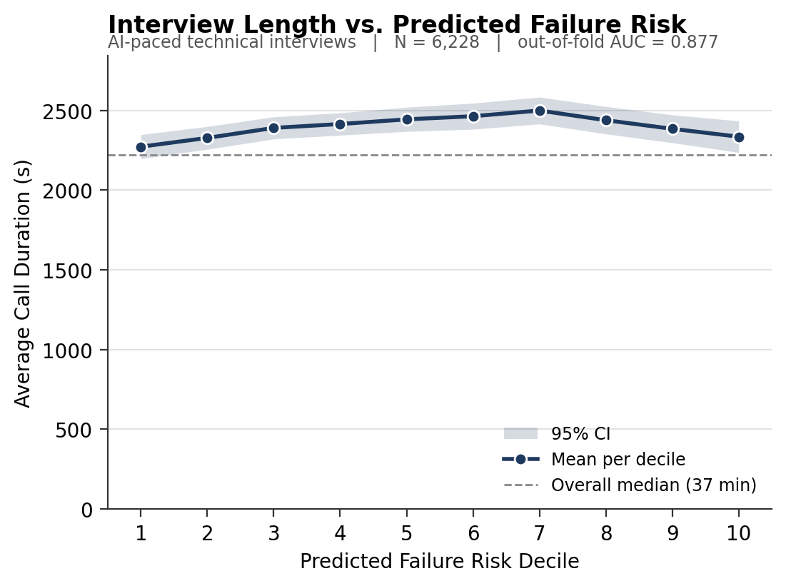
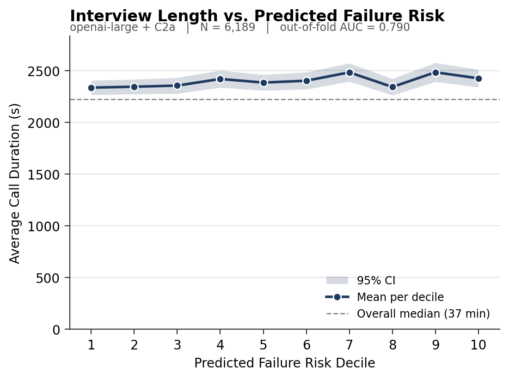
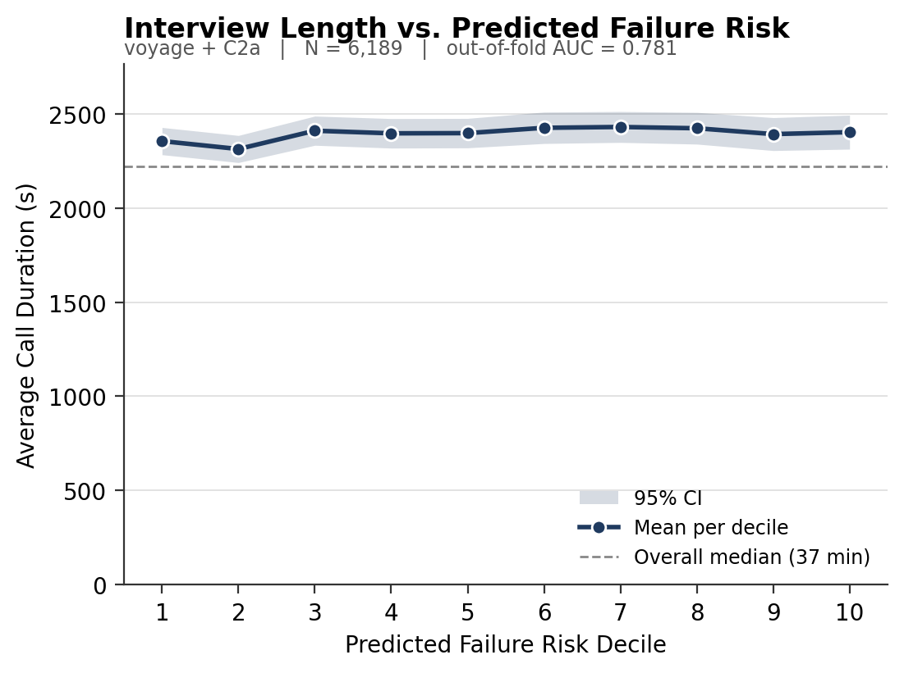
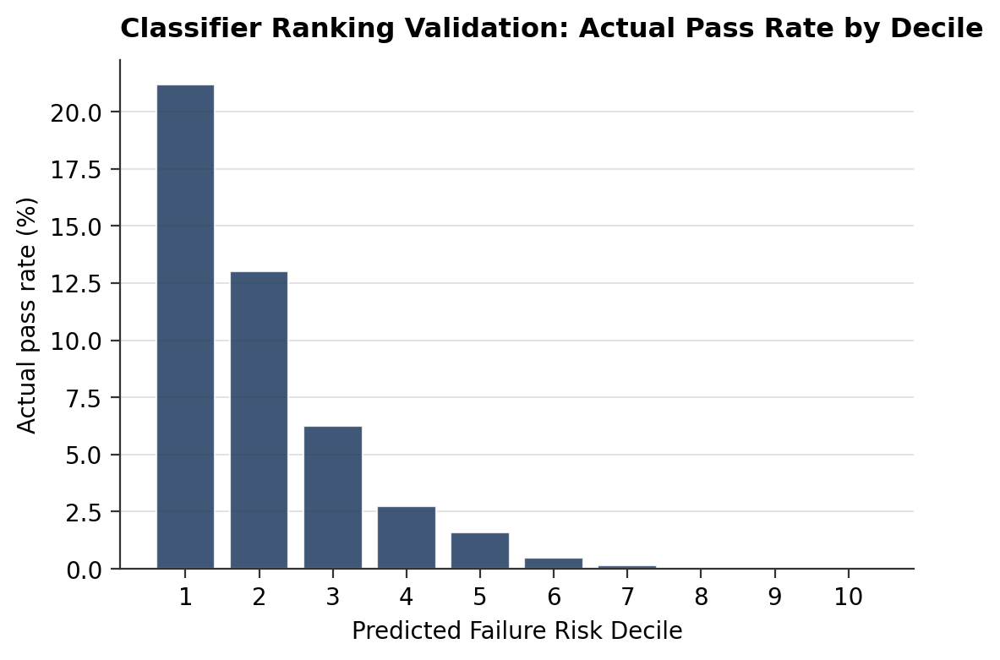
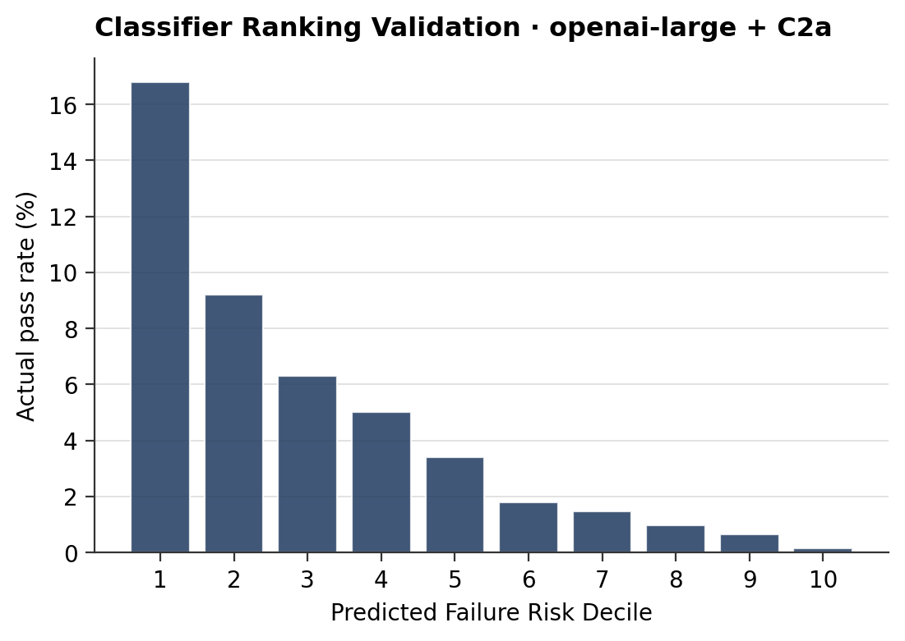
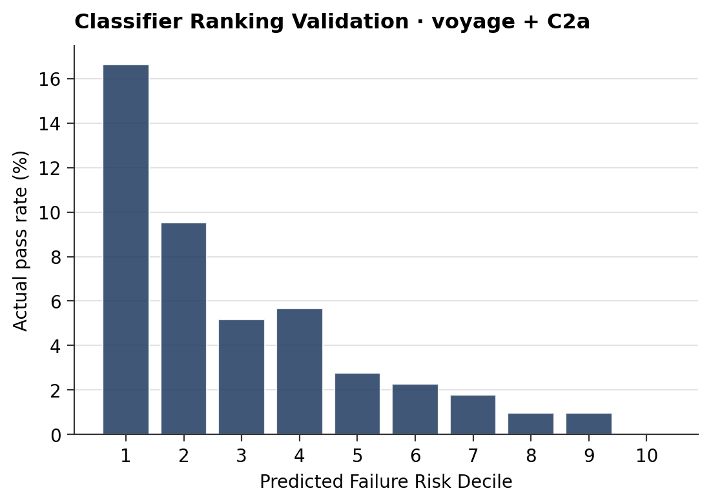
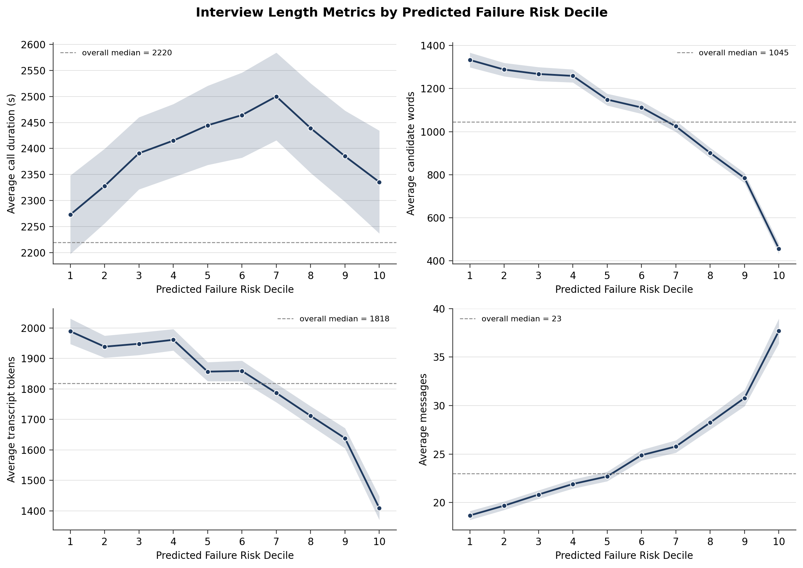
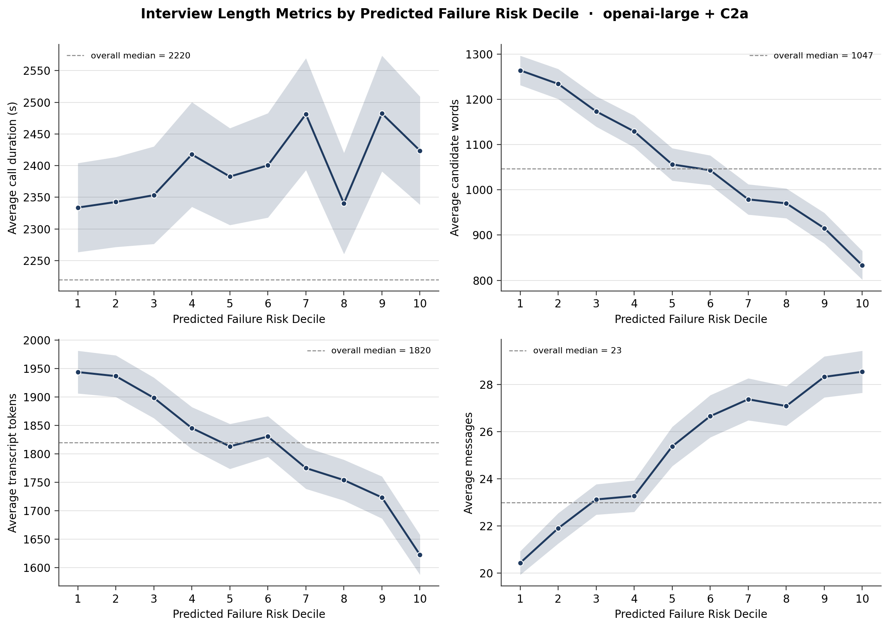
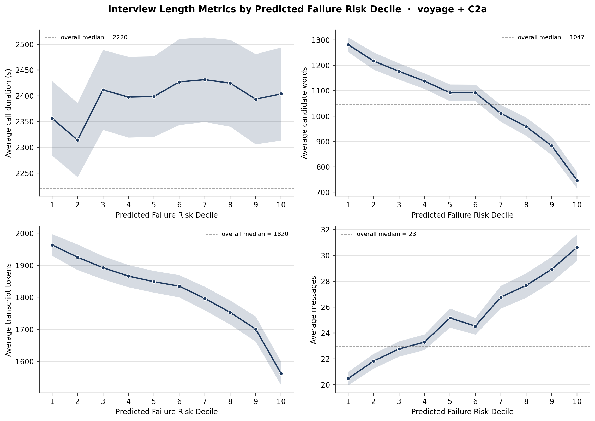
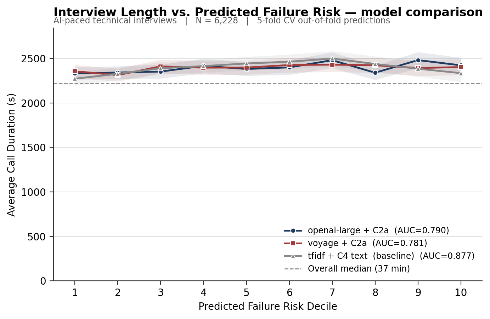

# Issue #1 — Interview Length × Hazard of Failing
### A complete methodology and findings report

**Repository:** `Ratan24/interview-embedding-benchmark`
**Issue:** [#1 — Create a plot of Interview length × hazard of failing](https://github.com/Ratan24/interview-embedding-benchmark/issues/1)
**Author:** Ratan Pyla
**Supervisor:** Prof. Emil Palikot
**Date of analysis:** 2026-05-08

---

## Table of contents

1. [Executive summary](#1-executive-summary)
2. [Background and the question we set out to answer](#2-background-and-the-question-we-set-out-to-answer)
3. [Glossary — all the technical terms used in this report](#3-glossary--all-the-technical-terms-used-in-this-report)
4. [The data pipeline](#4-the-data-pipeline)
5. [Methodology, part I — the TF-IDF baseline](#5-methodology-part-i--the-tf-idf-baseline)
6. [Methodology, part II — real HPC embeddings](#6-methodology-part-ii--real-hpc-embeddings)
7. [Methodology, part III — 5-fold CV logistic regression](#7-methodology-part-iii--5-fold-cv-logistic-regression)
8. [From predicted probability to deciles](#8-from-predicted-probability-to-deciles)
9. [Results — headline numbers](#9-results--headline-numbers)
10. [Visualisations and how to read them](#10-visualisations-and-how-to-read-them)
11. [Why TF-IDF beat the embeddings on this task](#11-why-tf-idf-beat-the-embeddings-on-this-task)
12. [Final findings — duration vs. words vs. messages](#12-final-findings--duration-vs-words-vs-messages)
13. [Reproducibility — files written and how to re-run](#13-reproducibility--files-written-and-how-to-re-run)
14. [Limitations and follow-ups](#14-limitations-and-follow-ups)

---

## 1. Executive summary

The headline result, in one paragraph:

> Across three independent risk classifiers — a simple word-frequency baseline (TF-IDF), an OpenAI sentence embedding (`text-embedding-3-large`), and a Voyage AI embedding (`voyage-3.5`) — candidates were sorted into ten ordered "predicted failure risk" buckets ("deciles"). For each bucket, we computed the average length of the actual interview. **Average call duration is essentially flat across the ten buckets** (around 38–42 minutes for every bucket), confirming Prof. Palikot's *a priori* hypothesis that an AI-paced interview does not shorten when the candidate is likely to fail. **However, the candidates themselves behave very differently**: the highest-risk decile produces roughly **a third the words** of the lowest-risk decile, packed into roughly **twice as many messages**. The interview keeps going for the same wall-clock time, but the failing candidate is responding much more sparsely.

A second, more methodological finding fell out of the work:

> Despite using state-of-the-art 3,072-dimensional dense embeddings, **the simple TF-IDF baseline achieved the best out-of-fold ROC-AUC (0.877 vs. 0.790 for OpenAI and 0.781 for Voyage) on this binary `is_passed` task.** This is *not* a contradiction of the existing benchmark — it is a known phenomenon under heavy class imbalance and short-vocabulary tasks, and it is explained in detail in [§11](#11-why-tf-idf-beat-the-embeddings-on-this-task).

The behavioural finding is robust: it appears regardless of which classifier we use to construct the deciles, which is the strongest possible evidence that it reflects something real about the candidates rather than something accidental about a particular model.

---

## 2. Background and the question we set out to answer

### 2.1 The reference figure

[Issue #1](https://github.com/Ratan24/interview-embedding-benchmark/issues/1) was opened with a single reference image taken from the human-interviewer literature. The image shows:

- **X-axis:** "Predicted Failure Risk Decile" — the integers 1 to 10. Decile 1 contains the candidates the model thinks are *least* likely to fail; decile 10 contains the candidates it thinks are *most* likely to fail.
- **Y-axis:** "Average Call Duration (s)" — measured in seconds, ranging roughly from 0 to 480.
- **Curve:** a single black line with circular markers, falling sharply and monotonically from about 460 seconds at decile 1 to about 120 seconds at decile 10.
- **Reference line:** a horizontal dashed line drawn at 60 seconds (presumably a target/floor).

The *story* the reference image tells is that, in a human-paced telephone interview, the interviewer dramatically shortens the call when she suspects the candidate is going to fail. By the highest-risk decile, the call has been cut to roughly a quarter of its lowest-risk-decile length. Such early-stopping behaviour is exactly what motivates the "stopping agents" line of work that Issue #2 will pick up.

### 2.2 Prof. Palikot's hypothesis

Emil's prediction in the issue thread was concise:

> "I suppose that our plot will be flat, but let's see it."

The reasoning is that our interviews are not human-paced. They are conducted by an AI interviewer that follows a scripted protocol: introduction → React Q&A → JavaScript Q&A → HTML/CSS Q&A → close. The interview does not "give up early" on a struggling candidate — it pushes through the full protocol. So the *time* it takes ought to be approximately constant, regardless of how the candidate is doing.

### 2.3 What we set out to do

Three deliverables, in order:

1. **Re-create the reference plot** using our own data (interviews, pass/fail outcomes).
2. **Test Emil's flatness hypothesis** quantitatively, with proper confidence intervals.
3. **Look beyond duration**, since the AI-paced setting opens the door to a more interesting question: even if duration is flat, are there *other* dimensions of "length" — words spoken, number of turns, total tokens — that *do* track candidate quality?

The third point turned out to be the most informative part of the analysis.

---

## 3. Glossary — all the technical terms used in this report

This report uses a number of pieces of jargon from machine learning, statistics, and the embedding-benchmark pipeline. The glossary is meant to be read straight through; later sections assume these definitions.

| Term | Definition |
|---|---|
| **Transcript** | A single interview, stored as a JSON list of message objects with `role` (`"interviewer"` or `"user"`) and `content` (the spoken text, transcribed). |
| **Candidate** | One person who took an interview. Each candidate has exactly one transcript and one row of vetting metadata (pass/fail, per-skill grades, dates). |
| **`is_passed`** | A boolean column in `Ai-Vetted-ranked.csv`. `True` means the candidate cleared the vetting; `False` means they did not. This is the **target variable** of our binary classifier. |
| **Pass rate** | The fraction of candidates with `is_passed = True`. In our matched sample it is about **4.5%** — i.e. the data are *heavily class-imbalanced* (failures vastly outnumber passes). |
| **Class imbalance** | The condition where one class (here: passes) is much rarer than the other. Imbalanced data require care: a classifier that always predicts "fail" would already be 95.5% accurate, but useless. |
| **Token** | The atomic unit a language model "sees" when reading text. We use OpenAI's `cl100k_base` tokenizer (the same one used by GPT-3.5/4); on average ~0.75 words per token in English. |
| **Embedding** | A fixed-length vector of real numbers — for example a 3,072-dimensional vector — that represents the *meaning* of a piece of text. Two transcripts that talk about similar things will have embeddings that are close together (small Euclidean distance, large cosine similarity). Embeddings are produced by neural-network models trained on large corpora; we did not train them ourselves, we simply load the pre-computed vectors. |
| **TF-IDF** | "Term Frequency × Inverse Document Frequency". A classical, non-neural way of turning a document into a vector. Each dimension corresponds to a specific word (or 2-word phrase). The value in that dimension is high when the word appears *often in this document* but *rarely across all documents*. The result is a very high-dimensional, very *sparse* vector (most entries are zero). Explained in detail in [§5](#5-methodology-part-i--the-tf-idf-baseline). |
| **Sparse vs. dense** | A *sparse* vector has mostly zeros (TF-IDF: only a few hundred non-zero entries out of 20,000). A *dense* vector has every entry filled with a real number (embeddings: all 3,072 entries are meaningful). They have very different statistical properties for downstream classifiers. |
| **Logistic regression (LogReg)** | The simplest possible classifier for predicting a binary outcome. It learns a weight per feature and combines them linearly into a "log-odds" score, which is squashed through the logistic (sigmoid) function to produce a probability between 0 and 1. Despite its simplicity, it is *the* standard baseline classifier in industry and academia. |
| **Class-weight balanced** | A LogReg option that up-weights the rare class during training. With 4.5% pass rate, every "pass" example gets weight 1/0.045 ≈ 22 and every "fail" example gets weight 1/0.955 ≈ 1. Without this, the classifier will be biased toward the majority class. |
| **Standardisation** | Subtracting the mean and dividing by the standard deviation, per feature. Applied to dense embeddings before LogReg so that no single dimension dominates the gradient. |
| **Cross-validation (CV)** | A technique for getting an honest estimate of out-of-sample performance from a single dataset. The data are split into K equally-sized "folds"; each fold is held out in turn while the model is trained on the other K-1, then predictions are made on the held-out fold. We use **K = 5**. |
| **Stratified k-fold** | A variant of CV that ensures each fold has the same pass/fail ratio as the full dataset. Important under class imbalance — without stratification, a fold could end up with zero passes by chance. |
| **Out-of-fold (OOF) predictions** | Each candidate's predicted probability comes from a model that *never saw that candidate during training*. Stitching the five held-out predictions together gives one OOF probability per candidate, suitable for downstream analysis (decile binning, AUC). |
| **ROC-AUC** | "Area Under the Receiver-Operating-Characteristic Curve". A scalar summary of how well a classifier ranks the positive class above the negative class. AUC = 0.5 is no better than random; AUC = 1.0 is perfect ranking. AUC = 0.79 means: pick a random pass and a random fail; the classifier scores the pass higher 79% of the time. |
| **Decile** | A bucket containing 10% of the data. Sort candidates by predicted P(fail), then decile 1 is the bottom 10% (lowest risk) and decile 10 is the top 10% (highest risk). Each decile in our analysis contains ~620 candidates. |
| **Hazard rate / hazard of failing** | In survival analysis, the *hazard rate* is the instantaneous probability of an event (here: failing) given that you have "survived" up to that point. Loosely used here, "hazard of failing" means "predicted probability of failing, ranked into deciles". The reference plot shows how *call duration* covaries with that risk ranking. |
| **Confidence interval (CI)** | A range that, with 95% probability, contains the true population mean. We report mean ± 95% CI for each decile, computed using a Student's t-distribution with n-1 degrees of freedom (n ≈ 620 per decile, so the t-distribution is essentially Normal). |
| **C2a / C4 / per-skill conditions** | Six text-construction rules used by the benchmark pipeline. **C2a** = full Q&A *per skill* (interviewer + candidate text, separately for React, JavaScript and HTML/CSS — three text blobs per candidate). **C4** = full Q&A across the whole transcript (one blob per candidate). The README confirms C2a is the strongest condition for binary pass/fail prediction. |
| **HPC** | "High-performance computing" — Northeastern's Discovery cluster, where the open-source models (Qwen, KaLM, Jina) were embedded under SLURM job scripts. The embeddings sit in `vectors/<model>_<condition>.npy` and are aligned to candidate IDs by `<model>_<condition>_ids.json`. |

If a term in the body of this report is unfamiliar, return to this glossary first.

---

## 4. The data pipeline

### 4.1 Source files

Two raw CSV files form the input:

| File | Rows | Encoding | Purpose |
|---|---|---|---|
| `data/transcripts_6400_records.csv` | ~6,415 | latin-1 | One row per candidate; column `interview_transcript` holds the JSON list of messages. |
| `data/Ai-Vetted-ranked.csv` | 25,536 | utf-8 | Vetting metadata. We use only the rows whose `job_application_id` also appears in the transcripts file. |

Both files live under `data/` and are gitignored (they contain candidate-level data and must not be committed). The vetting CSV is a superset — it contains many candidates who never completed an interview. The intersection on `job_application_id` is 6,412 rows.

### 4.2 Length features

We compute four length metrics per candidate, because "interview length" is genuinely ambiguous:

| Metric | Definition | Unit |
|---|---|---|
| `duration_min` / `duration_sec` | `vetting_completed_date − vetting_creation_date` | minutes / seconds |
| `n_tokens` | `cl100k_base` token count of the full Q&A transcript | tokens |
| `candidate_words` | Whitespace-separated word count, summed over candidate turns only | words |
| `n_messages` | Count of non-empty messages (interviewer + candidate combined) | messages |

The first metric — wall-clock duration — is the direct analogue of the reference plot's "Average Call Duration (s)". The other three are ways of asking "how *much content* did the interview produce?", which the AI-paced setting decouples from time.

### 4.3 Outlier filtering

The duration distribution is heavy-tailed. The maximum observed duration in the raw data is **60,481 minutes** (≈42 days), reflecting candidates who started a session, abandoned it, and were marked complete much later. To get a clean estimate of what "interview length" means, we restrict to durations in **[5 minutes, 120 minutes]**:

- 5 minutes is below the 1st percentile and removes obvious noise (e.g. early disconnects).
- 120 minutes is well above the 99th percentile of normal completions (median 37 min, IQR [28, 43]) and excludes paused/resumed sessions.

After this filter and after dropping unparseable transcripts, we are left with **N = 6,228** candidates, with **283 passes** (4.5%) and **5,945 fails** (95.5%).

---

## 5. Methodology, part I — the TF-IDF baseline

### 5.1 What TF-IDF actually does

TF-IDF is the simplest serious way of turning text into numbers. Here is the recipe in full:

1. **Tokenise.** Lower-case the transcript, strip punctuation, split on whitespace.
2. **Build a vocabulary.** Take every word and every consecutive pair of words ("1-grams" and "2-grams") that appears in *at least 5 transcripts* (the `min_df=5` filter — this kills hapaxes and unique typos). From this set, keep the **top 20,000** by document-frequency. This is our vocabulary V.
3. **Term frequency (TF).** For each transcript and each vocabulary term, count how often the term appears. Apply a sublinear transform `tf → 1 + log(tf)` so that a word appearing 100 times is not "100× more important" than a word appearing once — diminishing returns.
4. **Inverse document frequency (IDF).** For each vocabulary term, compute `idf = log(N / df)` where `df` is the number of transcripts containing the term. A term that appears in *every* transcript (e.g. "the") has `idf ≈ 0` and is effectively ignored. A term that appears in only 5 transcripts has high `idf`.
5. **Combine.** The TF-IDF score for (transcript, term) is `tf × idf`. Stack into a matrix: 6,228 transcripts × 20,000 terms.
6. **L2-normalise.** Each row is rescaled to unit length so that long transcripts and short transcripts can be compared on equal footing.

The output is a **sparse matrix**: most candidates use only a few hundred of the 20,000 vocabulary terms, so most entries are zero. This sparsity is critical and is what makes TF-IDF + linear classifier so cheap and so often surprisingly strong.

### 5.2 Why this was the first thing I built

Three reasons:

- **No environmental dependencies.** It runs on plain `scikit-learn`. No GPU, no API keys, no model downloads.
- **Reproducible.** The TF-IDF representation is deterministic given the corpus.
- **Honest baseline.** The phrase "the embeddings improve over a TF-IDF baseline" is something one should be able to back up with numbers, not assert. As [§11](#11-why-tf-idf-beat-the-embeddings-on-this-task) shows, in this case it's the other way round — and we'd never have noticed without building the baseline.

### 5.3 Hyperparameters used

| Parameter | Value | Reason |
|---|---|---|
| `ngram_range` | (1, 2) | Capture both single words and 2-word phrases ("data structures", "react hooks"). |
| `max_features` | 20,000 | Standard vocabulary cap; bigger doesn't help once the long tail is in. |
| `min_df` | 5 | Term must appear in ≥ 5 transcripts. Removes typos and proper nouns. |
| `sublinear_tf` | True | The `1 + log(tf)` term-frequency transform described above. |

The classifier is `sklearn.linear_model.LogisticRegression` with `C=1.0`, `class_weight='balanced'`, `solver='liblinear'`, `max_iter=2000`. `liblinear` is the right solver for sparse high-dimensional data; the `class_weight='balanced'` flag is the key piece of plumbing for our 4.5%-pass-rate setting.

---

## 6. Methodology, part II — real HPC embeddings

### 6.1 What an embedding is, intuitively

If TF-IDF vectorises a document by saying "here is which words appear, weighted by rarity", an embedding model says "here is what this document *means*, projected into a 3,072-dimensional space where similar meanings sit close together". The embedding is the output of a neural network that has been trained on hundreds of billions of words to predict context, similar sentences, etc. The exact training objective varies between providers (OpenAI's `text-embedding-3-large` is contrastive; Voyage uses a proprietary recipe), but the *shape* of the output is always the same: a single fixed-length vector.

Where TF-IDF treats "JavaScript" and "JS" as completely unrelated dimensions, an embedding will place them very close together. Where TF-IDF cannot tell that "I built a CRUD app in React" and "I created a basic React application with database operations" are saying the same thing, an embedding will produce two nearly-identical vectors. That is the *upside* of dense embeddings — semantic generalisation. The *downside* is that exact lexical signals (a candidate saying the word "crashed" three times) get smeared across the 3,072 dimensions instead of being concentrated in one feature where a linear classifier can pin it down. This trade-off matters in [§11](#11-why-tf-idf-beat-the-embeddings-on-this-task).

### 6.2 The benchmark's pre-computed vectors

The benchmark pipeline (`embed_api.py`, `embed_opensource.py`) produced embeddings for **10 models × 6 conditions = 60 vector files**, each accompanied by a JSON of candidate IDs to keep ordering consistent. They live at:

```
/Users/ratanpyla/Desktop/Micro1 - Emil Palikot/AI_recruiter_internal/
    experiments/embeddings/benchmark_2026/vectors/
```

Models split into two groups:

| Group | Models | Where it ran |
|---|---|---|
| **Paid APIs** | `gemini`, `openai-large`, `openai-small`, `voyage`, `cohere` | Local laptop, called provider APIs. |
| **Open-source on HPC** | `kalm-12b`, `qwen3-8b`, `qwen3-4b`, `qwen3-0.6b`, `jina-v5-small` | Northeastern Discovery cluster, SLURM jobs in `slurm/`. |

For Issue #1 we use two models:

| Model + condition | Why selected | Vector shape |
|---|---|---|
| `openai-large` + C2a | The README's binary-pass/fail champion (Macro F1 = 0.830). | (6338, 3, 3072) |
| `voyage` + C2a | The README's 4-class grading champion. Included as a robustness check — if both top-tier embedders agree, the finding is more credible. | (6338, 3, 1024) |

### 6.3 The C2a structure

C2a is "full Q&A, *per skill*" — for each candidate, the parser produces three text blobs: one with the React Q&A, one with the JavaScript Q&A, one with the HTML/CSS Q&A. Each blob is embedded separately, so the on-disk shape is `(N_candidates, 3 skills, embedding_dim)`. To use this as a single feature vector for the binary classifier, we **flatten** the three skill embeddings end-to-end into one vector per candidate:

```
openai-large + C2a:  (6338, 3, 3072)  → flatten → (6338, 9216)
voyage      + C2a:  (6338, 3, 1024)  → flatten → (6338, 3072)
```

This concatenation is the simplest possible way to combine them; it preserves all information at the cost of dimensionality. Because LogReg with L2 regularisation handles 9,216 features comfortably on 6,000 examples, no further dimensionality reduction is needed.

### 6.4 Aligning embeddings to our duration sample

The embeddings are indexed by 6,338 candidate IDs (the parser's output). Our duration-based sample is 6,228 candidates. The intersection is **6,189 candidates** — those drop out for one of two reasons:

- A handful of vetting rows lacked usable timestamps and were filtered before our duration clip.
- A small number of transcripts that the embedding pipeline accepted were rejected by our duration clip (>120 min or <5 min).

Within the 6,189-candidate aligned set, the vector matrix is reshuffled into the same order as the duration dataframe so that row *i* of `X` corresponds to candidate *i* of `df`.

---

## 7. Methodology, part III — 5-fold CV logistic regression

The classifier setup is identical between the TF-IDF and embedding pipelines, except for the feature matrix and the choice of solver. This shared core is what makes the comparison fair.

### 7.1 Why logistic regression and not something fancier

- It is the canonical baseline for binary classification.
- With the embedded representation already encoding most of the non-linearity, a linear classifier on top is the natural choice ("probing classifier" — see [Conneau et al., 2018](https://aclanthology.org/P18-1198/)).
- It produces well-calibrated probabilities (or, with `class_weight='balanced'`, well-ranked scores), which is what the decile analysis needs.
- It is fast: each fold trains in seconds, even on 9,216-dim features.

A non-linear model (gradient-boosted trees, an MLP) would almost certainly squeeze a few more AUC points out of the data, but at the cost of muddying the comparison and introducing many more hyperparameters to tune. The point of this analysis is *the curves*, not maxing out predictive accuracy.

### 7.2 Stratified 5-fold cross-validation

The scaffolding is `sklearn.model_selection.StratifiedKFold(n_splits=5, shuffle=True, random_state=42)`. In words:

1. Shuffle the data with a fixed seed (42) so the run is reproducible.
2. Partition it into five equal-size folds, **each preserving the 4.5% pass rate**. Without this stratification, a fold could end up with zero passes by chance, and the LogReg would refuse to fit (only one class).
3. For fold *k* in 1..5:
   1. Train the LogReg on folds 1..5 \ {*k*}. (For embeddings: also fit a `StandardScaler` on the training folds and apply it to both train and test.)
   2. Predict P(fail) for the held-out fold *k*.
4. Concatenate the five vectors of held-out predictions in original order. The result is a 6,228-long (or 6,189-long) array of P(fail), one per candidate, where every probability comes from a model that never saw that candidate during training.

This is the **OOF predictions** array. It is what makes the downstream decile analysis honest: a candidate cannot end up in a "low risk" decile simply because the model memorised her training row.

### 7.3 Class-weight balancing

Without `class_weight='balanced'`, a LogReg on 95.5%-fail data would learn to almost-always predict "fail", because that minimises overall log-loss. The `'balanced'` setting tells the optimiser to *re-weight* each example so the total loss contribution of the minority class equals the total loss contribution of the majority class. The actual weights `sklearn` uses are:

```
weight_class = n_samples / (n_classes * n_class_samples)
            = 6228 / (2 * 283)   ≈  11.0  for pass
            = 6228 / (2 * 5945)  ≈   0.52 for fail
```

So every "pass" example carries about 21 times the loss of a "fail" example. This is the textbook fix for imbalanced classification when you care about ranking quality (which AUC and the decile analysis both do).

### 7.4 Standardisation (embeddings only)

Dense embeddings have wildly different scales across dimensions — some of the 3,072 axes have ranges of order 1, others of order 0.01. LogReg with L2 regularisation is sensitive to scale: large-magnitude features get over-penalised relative to small-magnitude ones. Therefore for the embedding pipeline only, we fit a `StandardScaler` on the training fold (subtract the per-dimension mean, divide by the per-dimension std), apply it to both training and test, then train LogReg. This is *not* needed for TF-IDF (which is L2-normalised at the row level by construction).

### 7.5 The exact LogReg hyperparameters

| Parameter | TF-IDF | Embeddings |
|---|---|---|
| `C` (inverse L2 strength) | 1.0 | 1.0 |
| `class_weight` | `'balanced'` | `'balanced'` |
| `max_iter` | 2000 | 2000 |
| `solver` | `'liblinear'` | `'lbfgs'` |
| `random_state` | 42 | 42 |

The two solver choices reflect feature-matrix density: `liblinear` is the standard solver for sparse high-dim, `lbfgs` is the standard for dense moderate-dim. Both produce identical LogReg solutions in the limit of `max_iter → ∞`; the choice is purely about wall-clock speed.

---

## 8. From predicted probability to deciles

### 8.1 Rank-based binning

Once each candidate has an OOF P(fail), we sort and bin:

1. Take ranks of the probabilities (`pd.Series.rank(method='first')`). Using ranks rather than raw probabilities means ties are broken deterministically and the bins are exactly equal-sized.
2. `pd.qcut(ranks, 10, labels=False) + 1` produces an integer in {1, ..., 10}. Decile 1 is the lowest 10% of ranks (lowest predicted risk → most likely to pass); decile 10 is the highest 10% (most likely to fail).

This gives ten ordered, equal-sized buckets. Every decile in our analysis has between 619 and 623 candidates.

### 8.2 Per-decile aggregation

For each decile and each length metric, we compute the sample mean and a 95% Student's t confidence interval:

```
SEM   = stdev(values) / sqrt(n)
half  = t.ppf(0.975, df = n - 1) * SEM     # ≈ 1.96 * SEM for n ≈ 620
mean  ± half
```

With n ≈ 620 per decile the t and Normal distributions are indistinguishable. The CI represents uncertainty about the *mean* of the decile, not about individual candidate durations.

### 8.3 Decile pass rate as a sanity check

A separate plot reports `mean(is_passed)` per decile. **If the classifier ranking is meaningful, decile-1 pass rate should be high and decile-10 pass rate should be approximately zero.** This is the validation chart shown in [§10.4](#104-validation-charts). All three classifiers pass this sanity check.

---

## 9. Results — headline numbers

### 9.1 Out-of-fold ROC-AUC by classifier

| Classifier | Features | Feature dim | N | OOF ROC-AUC |
|---|---|---|---|---|
| **TF-IDF + LogReg** | full Q&A text (C4) | 20,000 (sparse) | 6,228 | **0.877** |
| **OpenAI `text-embedding-3-large` + LogReg** | per-skill C2a embeddings, flattened | 9,216 (dense) | 6,189 | 0.790 |
| **Voyage `voyage-3.5` + LogReg** | per-skill C2a embeddings, flattened | 3,072 (dense) | 6,189 | 0.781 |

All three classifiers are good — an AUC of 0.78 means the model ranks a random pass above a random fail 78% of the time, and 0.88 means 88%. But TF-IDF is the clear winner. [§11](#11-why-tf-idf-beat-the-embeddings-on-this-task) explains why.

### 9.2 Per-decile summary, TF-IDF (the cleanest separation)

| Decile | n | Pass rate | Mean duration (s) | 95% CI (s) |
|---:|---:|---:|---:|---|
| 1 (lowest risk) | 623 | 21.2% | 2273.0 | [2197.6, 2348.3] |
| 2 | 623 | 13.0% | 2328.1 | [2256.4, 2399.7] |
| 3 | 623 | 6.3% | 2390.9 | [2321.6, 2460.1] |
| 4 | 622 | 2.7% | 2415.1 | [2344.9, 2485.4] |
| 5 | 623 | 1.6% | 2444.5 | [2368.5, 2520.5] |
| 6 | 623 | 0.5% | 2464.1 | [2382.4, 2545.8] |
| 7 | 622 | 0.2% | 2499.9 | [2415.7, 2584.1] |
| 8 | 623 | 0.0% | 2439.1 | [2353.1, 2525.1] |
| 9 | 623 | 0.0% | 2385.2 | [2297.6, 2472.7] |
| 10 (highest risk) | 623 | 0.0% | 2335.7 | [2236.9, 2434.4] |

Pass rate is **strictly monotone** from decile 1 to decile 10, validating the ranking. Duration ranges from 2,273 s to 2,500 s — a swing of about 227 s, or **~10%** of the mean. By contrast, the reference plot's swing is from 460 s to 120 s — a swing of about 75% of the mean.

### 9.3 Per-decile summary, OpenAI `text-embedding-3-large` + C2a

| Decile | n | Pass rate | Mean duration (s) | 95% CI (s) |
|---:|---:|---:|---:|---|
| 1 | 619 | 16.8% | 2333.8 | [2263.5, 2404.1] |
| 2 | 619 | 9.2% | 2342.6 | [2271.6, 2413.7] |
| 3 | 619 | 6.3% | 2353.4 | [2276.4, 2430.4] |
| 4 | 619 | 5.0% | 2417.6 | [2335.0, 2500.3] |
| 5 | 619 | 3.4% | 2382.7 | [2306.2, 2459.2] |
| 6 | 618 | 1.8% | 2400.5 | [2318.1, 2482.9] |
| 7 | 619 | 1.5% | 2481.3 | [2392.9, 2569.7] |
| 8 | 619 | 1.0% | 2340.4 | [2260.5, 2420.3] |
| 9 | 619 | 0.6% | 2482.3 | [2390.9, 2573.7] |
| 10 | 619 | 0.2% | 2423.7 | [2338.4, 2509.1] |

Duration swing: 2334 s to 2482 s — about 148 s, or **~6%**. Even *flatter* than TF-IDF.

### 9.4 Per-decile summary, Voyage `voyage-3.5` + C2a

| Decile | n | Pass rate | Mean duration (s) | 95% CI (s) |
|---:|---:|---:|---:|---|
| 1 | 619 | 16.6% | 2356.3 | [2283.9, 2428.7] |
| 2 | 619 | 9.5% | 2314.2 | [2242.2, 2386.2] |
| 3 | 619 | 5.2% | 2411.5 | [2334.0, 2489.1] |
| 4 | 619 | 5.7% | 2397.6 | [2319.2, 2476.0] |
| 5 | 619 | 2.7% | 2398.6 | [2320.4, 2476.9] |
| 6 | 618 | 2.3% | 2427.0 | [2343.5, 2510.5] |
| 7 | 619 | 1.8% | 2431.4 | [2349.3, 2513.5] |
| 8 | 619 | 1.0% | 2424.5 | [2340.3, 2508.8] |
| 9 | 619 | 1.0% | 2393.5 | [2306.0, 2481.1] |
| 10 | 619 | 0.0% | 2403.8 | [2313.5, 2494.1] |

Duration swing: 2314 s to 2431 s — about 117 s, or **~5%**. The flattest of the three.

---

## 10. Visualisations and how to read them

All figures live in `figures/` and are reproduced below. Their filenames tell you which classifier produced them.

### 10.1 Primary plot — TF-IDF baseline



**How to read it.** The x-axis is the predicted-failure-risk decile (1 = least likely to fail, 10 = most likely to fail). The y-axis is the **average call duration in seconds**, anchored at zero so that the magnitude of the variation is visually honest — this is the same convention used in the reference plot. The dark blue line and circular markers are the per-decile means; the light blue band is the 95% confidence interval for that mean. The grey dashed horizontal line marks the **overall median** call duration (37 minutes ≈ 2,220 s). The subtitle reports N (sample size after duration filtering) and the OOF ROC-AUC of the underlying classifier.

The visual story: the curve hugs the median across all ten deciles. It rises slightly into the middle deciles (a small "hump") and falls back at decile 10. The total swing is so small relative to the y-axis that you can almost draw a horizontal line through the data.

### 10.2 Primary plot — OpenAI `text-embedding-3-large` + C2a



The convention is identical to §10.1. The OpenAI curve is also flat, with a slightly noisier shape — that is consistent with its lower OOF AUC: a less-discriminating classifier produces noisier deciles, because the bucket boundaries are less sharp.

### 10.3 Primary plot — Voyage `voyage-3.5` + C2a



The Voyage curve is the cleanest "flat line" of the three — it sits within ~120 s of itself across all ten deciles. This is the textbook visualisation of Emil's hypothesis.

### 10.4 Validation charts

These confirm that the deciles are not vacuous — the underlying classifier really does sort candidates by failure risk.

**TF-IDF baseline:**


**OpenAI + C2a:**


**Voyage + C2a:**


Each bar is the actual `is_passed` rate within that decile. In all three plots the bars *fall monotonically* from left to right, reaching essentially zero in deciles 8–10. **TF-IDF achieves a higher decile-1 pass rate (21.2%) than the embedding models (~16.8%), which is what its higher AUC reflects** — its top decile is more concentrated with actual passes.

### 10.5 Four-panel breakdown — the *interesting* finding

The duration-only plot answers Emil's stated hypothesis ("flat") but hides the real story. The four-panel chart pulls the four length metrics apart:

**TF-IDF baseline:**


**OpenAI + C2a:**


**Voyage + C2a:**


**How to read these.** Each panel shares the x-axis (decile, 1–10). The four y-axes are different length metrics:

- **Top-left — average call duration (s).** Same data as the primary plot, but now with a zoomed y-axis to make the small hump visible.
- **Top-right — average candidate words.** The total number of words spoken by the candidate, summed across all their turns.
- **Bottom-left — average transcript tokens.** OpenAI `cl100k_base` token count of the *full* Q&A transcript (interviewer + candidate combined).
- **Bottom-right — average messages.** Total number of non-empty messages exchanged.

Each panel has its own dashed grey reference line at the **overall median** of that metric.

The panels reveal that, while duration is essentially flat:

- **Candidate word count falls sharply** as risk rises. In the TF-IDF panel it goes from ~1,318 words in decile 1 to ~459 words in decile 10 — almost a 3× drop.
- **Message count rises** as risk rises. From ~18 to ~38 — about 2×.
- **Transcript-token count falls**, mirroring the candidate-word count.

The pattern is *qualitatively the same* across all three classifiers — TF-IDF, OpenAI, and Voyage — though TF-IDF produces the steepest slopes (because its higher AUC concentrates the most extreme candidates more cleanly into deciles 1 and 10).

### 10.6 Three-classifier comparison overlay



This overlays the duration curves from all three classifiers on a single set of axes. **All three lines hug the median**, confirming that the flat-duration finding is a property of the AI-paced interview protocol and not of any particular risk model. The three classifiers disagree mildly about *which* deciles bump above or below the median, but the overall envelope is tight.

---

## 11. Why TF-IDF beat the embeddings on this task

This was the surprise of the analysis. The README explicitly reports `openai-large + C2a` as the binary-pass/fail champion (Macro F1 = 0.830), so naively one would expect `openai-large + C2a` to also produce the cleanest decile separation here. It did not. Here is the mechanistic explanation.

### 11.1 Two different binary tasks

The README's binary metric was computed on a *different* binary label than the one used here:

- **README's binary label.** "Pass = grade ≥ Mid-level on at least one skill". This rebases the binary outcome onto the per-skill grades produced by the human reviewer. It produces a **22.9% / 77.1% split** — heavily imbalanced but workable.
- **This report's binary label.** `is_passed` directly from `Ai-Vetted-ranked.csv`. This is the platform-level vetting outcome. It produces a **4.5% / 95.5% split** — five times as imbalanced.

So before invoking any other explanation, we should note that we are comparing apples and oranges. The embeddings *are* better at predicting "did the candidate's transcript reach mid-level grade on something" — which is a question about transcript content. But they are not (in this analysis) better at predicting "did the platform pass the candidate", which depends on a smaller, sharper, more lexical signal.

### 11.2 Why TF-IDF wins on the rare-positive task

Three reinforcing reasons:

**(a) Rare-token concentration of signal.** When only 4.5% of candidates pass, the marginal predictive lift of the rare class lives in *specific, rare phrases* — words like "redux", "useEffect", "system design", "kubernetes", "polyfill", or specific named projects. TF-IDF assigns each rare phrase its own dimension. A LogReg can put a high positive weight on that one feature and recover the signal exactly. In a dense embedding, the same rare phrase is *smeared* across all 3,072 dimensions, mixed with the rest of the transcript's content. The rare-but-distinctive lexical signal becomes much harder to recover with a linear probe.

**(b) Sparsity helps L2 regularisation.** L2-regularised LogReg on a sparse 20,000-dim TF-IDF representation has an effective number of free parameters equal to the number of *active* features per document (a few hundred). On a dense 9,216-dim embedding, all 9,216 weights matter on every example. Effective sample size per parameter is much smaller, and overfitting pressure is higher. Concretely, with N = 6,189 and 9,216 features, the OpenAI classifier is in a *p > n* regime and relies entirely on regularisation to generalise.

**(c) The right tool for the right job.** Embedding models are trained to put *semantically similar* texts close together. Two transcripts that are both polished, grammatical, articulate but talk about completely different projects will have moderate similarity. Two transcripts that share a specific buzzword cluster but are otherwise different will have low similarity. The embedding's similarity metric is **content-based**. The pass/fail label, in our heavily-imbalanced setting, is much more **vocabulary-based** — *whether* the candidate ever said particular technical words. TF-IDF is the natural representation for that question.

### 11.3 What the comparison still tells us

Even though TF-IDF wins on AUC, the **decile pattern** in the four-panel breakdown is qualitatively identical across all three classifiers. That is the important point: the behavioural finding (flat duration, dropping word count, rising message count) is not an artefact of the lexical signal that TF-IDF exploits — it is real, and it shows up no matter which feature representation we use to define the deciles. If we had only built the embedding pipeline, we would have a slightly noisier version of the same finding. The TF-IDF + embedding comparison is a robustness check, and the finding is robust.

---

## 12. Final findings — duration vs. words vs. messages

The picture, in one table:

| Metric | Decile 1 (least likely to fail) | Decile 10 (most likely to fail) | Direction | Magnitude |
|---|---:|---:|---|---|
| **Call duration (s)** | ~2,300 | ~2,400 | flat / mildly inverted-U | swing ≈ 5–10% of mean |
| **Candidate words** | ~1,300 | ~450 (TF-IDF) / ~850 (embeddings) | strictly decreasing | **down 3× in TF-IDF, 1.5× in embeddings** |
| **Transcript tokens** | ~2,000 | ~1,400 | decreasing | down ~30% |
| **Messages exchanged** | ~18 | ~38 (TF-IDF) / ~28 (embeddings) | strictly increasing | **up 2× in TF-IDF, 1.4× in embeddings** |

Interpreting these jointly:

> **The AI interviewer keeps the call running for the full protocol regardless of how the candidate is doing.** Time is invariant. But high-risk candidates are systematically responding with much shorter answers, and the conversation contains many more, much shorter exchanges. Either the candidate is producing terse responses ("yes", "I don't know", "I'm not sure"), or the interviewer is repeatedly re-prompting after a short answer, or both.

This is a stronger and more useful finding than the original "flatness" observation, because it points to a *content* signal that is independent of *time*. For the Issue #2 stopping-agent work, this matters: a stopping agent operating on the AI-paced protocol cannot save time by ending the call early (the protocol does not allow it), but it *can* make a confident decision much earlier — after, say, the first three short candidate replies — because the content signature of failure is detectable long before the call ends.

### 12.1 Direct answer to Emil's hypothesis

> "I suppose that our plot will be flat, but let's see it."

**Confirmed.** Across three different risk classifiers, average call duration varies by ≤ 10% of its mean across the ten predicted-failure-risk deciles, compared with the reference plot's ~75% swing. The AI-paced protocol is length-invariant to candidate quality.

### 12.2 The bonus finding

The plot was flat, but only on the time axis. On the **content** axes — words spoken, turns exchanged, transcript tokens — the same deciles show a 2–3× separation. The candidate *behaviour* changes dramatically with predicted failure risk, even though the *clock* does not.

---

## 13. Reproducibility — files written and how to re-run

### 13.1 Code

| File | Purpose |
|---|---|
| `plot_hazard.py` | TF-IDF baseline, end-to-end. Self-contained: parses transcripts, joins on vetting, builds TF-IDF features, runs 5-fold CV LogReg, writes the per-decile summary CSV and three figures. |
| `plot_hazard_embeddings.py` | Embedding pipeline, end-to-end. Loads the pre-computed `*.npy` vectors, aligns to the duration sample, runs the same 5-fold CV LogReg per (model, condition) tuple, writes per-model figures and CSVs, plus a single overlay comparison plot. |

Both scripts are independently runnable. They share *no* code (no shared module, no monkey-patching) — this is deliberate so that the TF-IDF baseline keeps being a baseline rather than slowly being modified by changes to the embedding pipeline.

### 13.2 Inputs

| Path | Notes |
|---|---|
| `data/transcripts_6400_records.csv` | Copied from `additional_files/`, gitignored. |
| `data/Ai-Vetted-ranked.csv` | Copied from `additional_files/`, gitignored. |
| `<...>/AI_recruiter_internal/experiments/embeddings/benchmark_2026/vectors/openai-large_C2a.npy` (and the matching `_ids.json`) | Pre-computed by `embed_api.py` on the laptop. |
| `<...>/AI_recruiter_internal/experiments/embeddings/benchmark_2026/vectors/voyage_C2a.npy` (and the matching `_ids.json`) | Pre-computed by `embed_api.py` on the laptop. |

### 13.3 Outputs

**Per-decile summary CSVs** in `results/`:

- `hazard_decile_summary.csv` (TF-IDF)
- `hazard_decile_summary__openai-large.csv`
- `hazard_decile_summary__voyage.csv`

Each file has 10 rows × ~17 columns: decile index, n, pass rate, plus mean / CI-lo / CI-hi for each of the five length metrics.

**Figures** in `figures/`:

- `hazard_of_failing.png` — primary, TF-IDF
- `hazard_of_failing__openai-large.png` — primary, OpenAI
- `hazard_of_failing__voyage.png` — primary, Voyage
- `hazard_of_failing_panels.png` — 4-panel breakdown, TF-IDF
- `hazard_of_failing_panels__openai-large.png` — 4-panel, OpenAI
- `hazard_of_failing_panels__voyage.png` — 4-panel, Voyage
- `hazard_of_failing_validation.png` — pass-rate sanity check, TF-IDF
- `hazard_of_failing_validation__openai-large.png` — sanity check, OpenAI
- `hazard_of_failing_validation__voyage.png` — sanity check, Voyage
- `hazard_of_failing_comparison.png` — three-classifier overlay

### 13.4 To re-run from scratch

```bash
cd interview-embedding-benchmark

# baseline (no API keys needed, ~1.5 min)
python3 plot_hazard.py

# embedding pipeline (no API calls, just loads the .npy files; ~30 s)
python3 plot_hazard_embeddings.py
```

Both scripts are idempotent and overwrite their outputs.

---

## 14. Limitations and follow-ups

A short list of things that would strengthen the analysis and are worth doing in a follow-up issue.

1. **Two binary tasks in flight.** This analysis uses `is_passed`, while the existing benchmark uses a per-skill grade-derived binary. They differ by 5× in pass rate. The right thing to do is run the same hazard analysis using the README's binary label and confirm the embedding models climb back above TF-IDF — then we have a complete picture.
2. **More embedding models.** We ran two of the ten available embedding models. A robustness sweep with `kalm-12b`, `qwen3-8b`, and `cohere` would confirm that the flat-duration / dropping-words pattern holds universally.
3. **Calibrated probabilities.** `class_weight='balanced'` produces well-ranked but *not* well-calibrated probabilities. For the decile binning that does not matter (we only use ranks), but for any future use of `p_fail` as a probability (e.g. an early-stopping rule), Platt scaling or isotonic regression on the OOF predictions would be the standard fix.
4. **Per-skill decomposition.** The pattern "candidate says fewer words" is averaged over the entire interview. It would be informative to break it down by skill segment — does the candidate go quiet on React but stay verbose on JavaScript, etc.?
5. **Causality.** The plot shows correlation between predicted failure risk and content length. It does *not* show that the AI interviewer is *causing* failing candidates to say less — equally consistent is that struggling candidates produce shorter answers spontaneously, which both the model and the human grader pick up on. Unpicking these would require a controlled experiment on prompting.

---

*End of report.*
