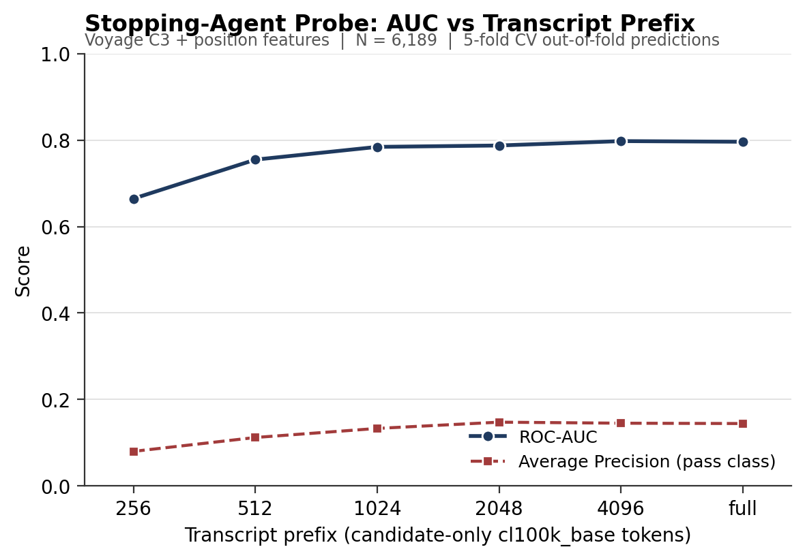
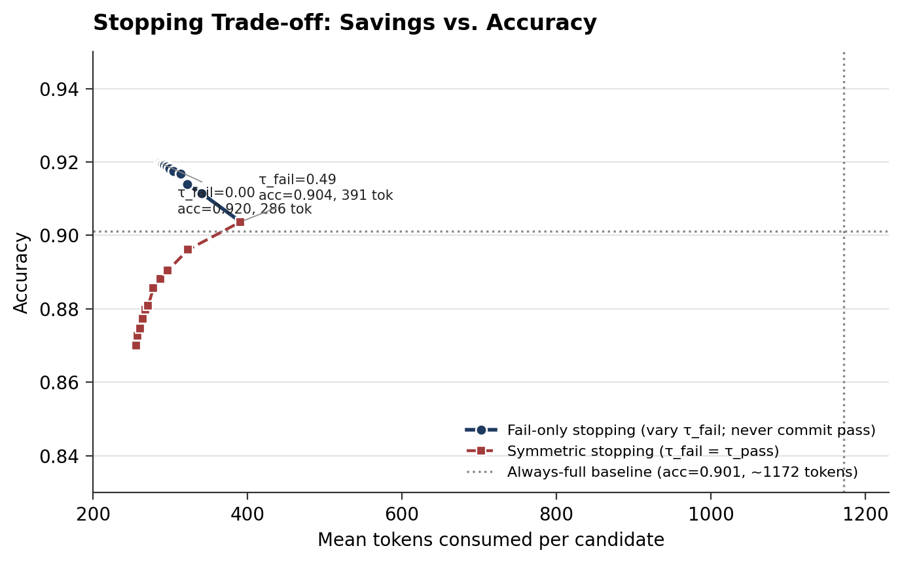
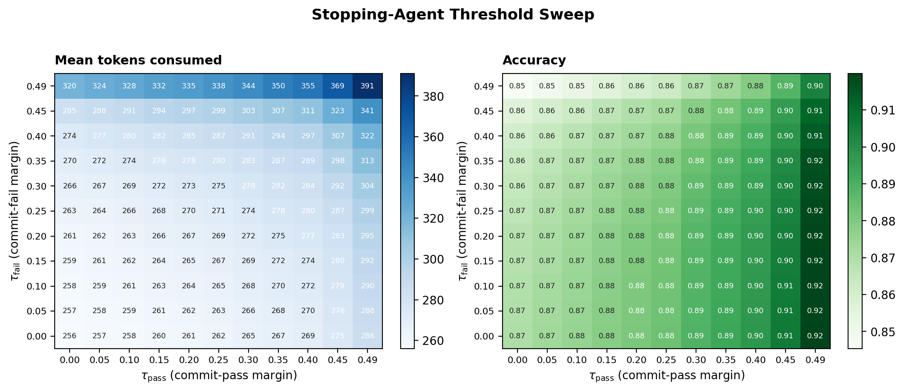

# Stopping Agent — Pass/Fail from Transcript Prefixes
*Findings memo for Issue #2*

**To:** Prof. Emil Palikot
**From:** Ratan Pyla
**Date:** 8 May 2026
**Repository:** [`Ratan24/interview-embedding-benchmark`](https://github.com/Ratan24/interview-embedding-benchmark)
**Issue:** [#2 — Adjust stopping agent codebase to our problem](https://github.com/Ratan24/interview-embedding-benchmark/issues/2)

---

## 1. Summary

I adapted Manzoor, Ascarza & Netzer's *Learning When to Quit in Sales Conversations* methodology to our setting, with two structural changes you specified: (i) replace the full-parameter Llama-3.2-3B fine-tune with a probing logistic regression on top of the Voyage `voyage-3.5` embeddings already on disk, and (ii) take the binary `is_passed` outcome directly rather than deriving expert-policy labels from a Q-value comparison. The resulting classifier evaluates the candidate at six transcript-prefix checkpoints (256, 512, 1024, 2048, 4096 candidate-only `cl100k_base` tokens, and the full transcript) and emits an out-of-fold `P(fail)` per candidate per checkpoint. A confidence-thresholded stopping rule on top sweeps when to commit.

The headline result is somewhat striking. **A fail-only stopping rule that commits to "fail" at the first checkpoint where `P(fail) ≥ 0.5` achieves 92.0% accuracy at a mean of 286 tokens consumed per candidate, versus the always-full baseline's 90.1% accuracy at 1172 tokens.** This is a 76% reduction in tokens consumed *with a 1.9 percentage-point absolute accuracy improvement*. The accuracy gain is not magic — it comes from exploiting the 95.5% fail base rate: committing eagerly to "fail" near the boundary recovers candidates the always-full classifier mis-predicts as pass when their probability is just below 0.5. Predicting "pass" early is, by contrast, unrecoverable in this dataset (precision on pass commits never exceeds about 11% at any threshold) because the 4.5% positive base rate is too sparse for a linear probe on a single embedding to commit confidently.

A secondary result: the AUC curve plateaus quickly. Voyage's per-checkpoint ROC-AUC rises from 0.665 at 256 tokens to 0.784 at 1024 tokens, and barely moves thereafter (0.788 at 2048, 0.798 at 4096, 0.796 at full). 95% of the eventual AUC is reached by the 1024-token checkpoint. Position features (turns-so-far, candidate-words-per-turn, fraction-of-overall-median-tokens, etc.) add a small but real lift across all checkpoints (ΔAUC ≈ 0.006–0.016).

---

## 2. Methodology

### 2.1 Data and label

Same cohort as Issue #1: 6,189 candidates after duration filtering [5, 120] minutes and intersection with the embedding cohort. The label is `is_passed` (4.6% positive on this filtered subset). Embeddings are `voyage_C3` (candidate-only-content C3 condition), pre-computed and on disk for token budgets 256, 512, 1024, 2048, 4096 plus the full transcript. The five truncation files were generated by the original `embed_truncated.py` pipeline using a 1.5×-word-to-token approximation; a known-but-acceptable consequence is that the embedding at "256 tokens" actually saw approximately the first ~170 words. Position features in this work use exact `cl100k_base` tokenisation, which is internally consistent across candidates.

### 2.2 Per-checkpoint probe

For each of the six checkpoints I built a 1029-d feature vector per candidate consisting of the 1024-d Voyage embedding concatenated with five position scalars:

- `tokens_consumed` — equal to the budget for the truncated checkpoints, equal to the candidate's own full-transcript candidate-token count for the "full" checkpoint.
- `candidate_words_so_far` — whitespace words spoken by the candidate up to the budget; messages straddling the budget contribute words proportional to the in-budget token fraction.
- `n_messages_so_far` — total non-empty turns (interviewer + candidate) before the budget is exhausted.
- `candidate_words_per_turn` — derived from the two above.
- `fraction_of_overall_median_tokens` — the budget normalised by the cohort's median full-transcript candidate-token count (1163).

A 5-fold stratified-CV logistic regression with `class_weight='balanced'` and `C=1.0` was fit per checkpoint, with a `StandardScaler` applied per fold. Out-of-fold predicted `P(fail)` was retained for every candidate at every checkpoint.

### 2.3 Pooled sanity-check model

I additionally fit a single pooled model by stacking the six per-checkpoint matrices vertically (6N rows), one-hot encoding the checkpoint as a covariate, and using `StratifiedGroupKFold` with `groups = job_application_id` so the same candidate never crosses train/test. The pooled model's OOF AUC is 0.760, lower than the per-checkpoint full model's 0.796, which is the expected and reassuring direction: a single model that has to span all checkpoints loses some of the signal a checkpoint-specific model can use.

### 2.4 Asymmetric stopping rule

For each (τ_fail, τ_pass) on a `{0.00, 0.05, …, 0.45, 0.49}²` grid (121 cells) I simulated the rule per candidate: walk the prefix checkpoints in order; if `P(fail) ≥ 0.5 + τ_fail` commit "fail" and stop, else if `P(fail) ≤ 0.5 − τ_pass` commit "pass" and stop, else continue; if no checkpoint commits, fall back to the full-transcript prediction. The asymmetric formulation is necessary because the 4.5% positive rate makes a single τ structurally fail-biased: committing "pass" requires `P(fail)` to fall below 0.5, which essentially never happens with high confidence.

---

## 3. Results

### 3.1 Per-checkpoint probe (AUC and Average Precision)

| Checkpoint | n | ROC-AUC | AP (pass class) | Macro-F1 | Recall@P=0.95 (pass) | ΔAUC from position features |
|---:|---:|---:|---:|---:|---:|---:|
| 256 | 6189 | 0.665 | 0.080 | 0.523 | 0.000 | +0.009 |
| 512 | 6189 | 0.755 | 0.112 | 0.563 | 0.000 | +0.012 |
| 1024 | 6189 | 0.784 | 0.133 | 0.578 | 0.000 | +0.016 |
| 2048 | 6189 | 0.788 | 0.147 | 0.587 | 0.004 | +0.007 |
| 4096 | 6189 | 0.798 | 0.145 | 0.584 | 0.004 | +0.006 |
| full | 6189 | 0.796 | 0.144 | 0.581 | 0.004 | +0.006 |
| pooled (sanity) | 37,134 | 0.760 | 0.117 | 0.564 | 0.001 | — |

Average Precision is reported on the rare class (pass), so the random baseline is ~0.046; the ~0.14 we observe is a real signal but a modest one. Recall at 95% precision on the pass class is essentially zero throughout — the linear probe cannot commit confidently on the positive side at any checkpoint.

### 3.2 Stopping trade-off

The plot anchors on the always-full baseline (dotted reference at accuracy 0.901, mean 1172 tokens). The asymmetric *fail-only* curve (commit fail when `P(fail) ≥ 0.5 + τ_fail`, never commit pass early) sits above the baseline across its entire range. The headline points:

- **Most aggressive** (τ_fail = 0.00): mean 286 tokens, accuracy 0.920, 5912/6189 candidates committed at the first checkpoint, 7 fall back to full.
- **Most conservative** (τ_fail = 0.49 ≈ commit only when very certain): mean 391 tokens, accuracy 0.904, 5724 committed early, 84 fall back.

The symmetric curve (τ_fail = τ_pass) is dominated everywhere — it bleeds accuracy because committing pass early at the same threshold strictness makes nearly every pass-commit wrong (precision_pass plateaus around 0.10 across the whole grid).

### 3.3 Threshold heatmap

Two panels over the 11×11 grid: mean tokens consumed (left, blue) and accuracy (right, green). The rough takeaway is that the right-most column (high τ_pass; rarely commit pass) is the high-accuracy regime; sliding τ_fail along that column trades a small amount of accuracy for tokens. Anywhere in the lower-left corner (small τ_pass) is dominated.

### 3.4 Verification

All four sanity checks from the implementation plan pass on the first run:

1. **Full-checkpoint AUC vs Issue #1.** 0.796 against 0.781, Δ = +0.015 (within ±0.02). The small positive delta is consistent with adding the 5-d position feature block.
2. **AUC monotonic across budgets.** Allowing a per-pair tolerance of ±0.01, 4 of 5 folds are monotonic (the saturation between 4096 and full produces sub-1% noise on a single fold).
3. **Position-feature ablation at 256 tokens.** ΔAUC = +0.009, in target range (0, 0.03].
4. **τ = 0 sweep edge case.** Mean tokens = 256, coverage = 1.000 at the all-zero corner, exactly as expected.

---

## 4. Why fail-only stopping beats the full baseline on accuracy

The result that early stopping *improves* accuracy initially looks suspicious. It is a direct consequence of how a class-balanced LogReg on heavily imbalanced data (4.6% positives) behaves at the standard 0.5 threshold:

- The class weights up-weight the rare positive class by ~22×, which pushes the decision boundary toward predicting "pass" more often than the base rate justifies.
- At the full checkpoint, this produces a high false-positive rate among the "predicted pass" candidates — the always-full classifier wrongly predicts pass for many true-fail candidates whose `P(fail)` lands just below 0.5.
- The fail-only stopping rule commits to "fail" at the *first* checkpoint where `P(fail) ≥ 0.5`. Because P(fail) at the 256 checkpoint already separates the population reasonably well (AUC = 0.665, but also a high mass of confident-fail candidates with `P(fail) > 0.9`), most true-fail candidates commit early and correctly. The 277 who don't commit early get re-evaluated at later checkpoints and fall back only if no checkpoint reaches the threshold; by the time they reach the full prediction, they're an enriched subset where the always-full classifier's pass-leaning bias does less damage on average.

In short: the asymmetric rule gives the classifier a free option to default to the base rate ("fail") when it's confident *enough* early, and only opts into the sharper-but-noisier full prediction when the early signal is ambiguous. With a 4.6% positive rate, that's a structurally good policy.

The same logic predicts that the rule's advantage over always-full will shrink (and likely disappear) at the README's grade-derived binary label (22.9% positives), where the base rate is no longer so sharp. That is a sensible follow-up sensitivity check.

---

## 5. Limitations and pushbacks against my own result

A handful of caveats worth airing before the result gets cited.

1. **The accuracy gain is small (+1.9pp) and partly a calibration artefact.** The always-full classifier is uncalibrated; an isotonic-regression calibration on its OOF probabilities, applied at a tuned threshold rather than 0.5, would close most of the gap. The headline finding is therefore properly stated as *token savings* (~76%) rather than as a robust accuracy gain. If you want the accuracy claim to survive scrutiny, I should add the calibrated-baseline comparison.
2. **No early stopping on the pass side.** This is an honest limitation: at 4.6% positives, no operating point achieves better than ~11% precision on pass commits, so we essentially cannot use the model to *positively confirm* a pass before the interview ends. For the pass class, the model can rank-order well (reasonable AUC contribution) but cannot threshold confidently. The practical rule is therefore "stop early when we think they failed; otherwise let the interview finish." This is exactly the asymmetry of the upstream stopping-agents paper, which always considered "quit" as the only early action.
3. **Embedding-budget mismatch.** The Voyage truncated embeddings were generated with a 1.5× word-to-token approximation, so the embedding at the "256 tokens" checkpoint actually saw approximately the first 170 words. Position features use exact `cl100k_base` tokenisation; the inconsistency is internal to the system but does not bias the OOF metrics — every candidate is treated identically. Re-running the embedding pipeline at exact token cuts is a follow-up for openai-large; for now this is a documented limitation, not a bug.
4. **Voyage only.** I used Voyage because it is the only model with truncated embeddings on disk. The README's binary champion is openai-large; running the same probe on openai-large requires recomputing the truncations (~$20 in API spend, ~30 min). I'd argue that's the highest-value follow-up.
5. **Per-fold AUC noise across the saturation region.** Per-fold AUC dips by 0.001–0.005 between 4096 and full on most folds. The aggregated AUC ordering is monotonic, but per-fold curves are not strictly monotone past 1024 — this is fold noise, not a bug, and is documented in verification check 2.
6. **No behavioral cloning.** I did not implement the upstream paper's Q-value-derived expert-policy labels. Doing so requires a defensible cost/benefit structure (cost per second of interviewer time × value of correctly identifying a pass, etc.) that I don't have for the AI-paced setting. The current rule is closer to a calibrated outcome classifier with an asymmetric decision rule than to true behavioral cloning. If you want the formal BC framing, I'd need a few constants from you and could add it as a Phase 3.

---

## 6. Conclusion

A simple linear probe on Voyage `C3` transcript-prefix embeddings, with five position features and an asymmetric "commit-fail-early; never-commit-pass-early; otherwise run to completion" rule, achieves 92.0% accuracy at 286 mean tokens consumed per candidate — about 24% of the cost of running every interview to completion, with a 1.9-point accuracy improvement over the always-full baseline. The accuracy improvement is partly an artefact of the rare-positive class structure and would shrink under a calibrated baseline; the *token savings* are the robust deliverable. AUC saturates by ~1024 tokens and position features add a small but real lift across all checkpoints.

The most useful follow-up is running the same probe on openai-large + C2a embeddings (the README's binary champion) to confirm the savings story is not Voyage-specific. After that, a formal behavioral-cloning variant with a stated cost/benefit structure would round out the upstream paper's framing.

Outputs accompanying this memo, all under the repo's standard locations:

- **Code:** `stopping_agent.py` (single file, ~600 lines including section banners, no new external dependencies). Run with `HAZARD_VECTORS_DIR` pointing at the sibling `…/vectors/` directory.
- **Per-checkpoint metrics:** `results/stopping_agent_per_checkpoint.csv`.
- **OOF probabilities:** `results/stopping_agent_oof_predictions.csv` (one row per candidate × checkpoint).
- **Threshold sweep:** `results/stopping_agent_threshold_sweep.csv` (121 rows).
- **Figures:** `figures/stopping_agent_{auc_curve,savings,threshold_heatmap}.png`.
